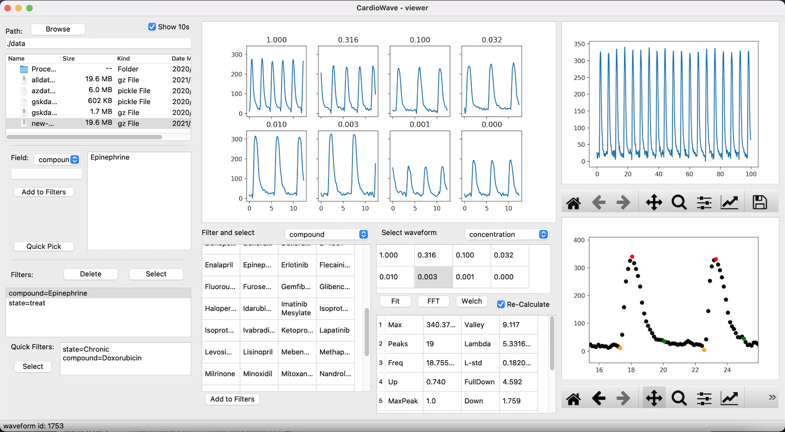

CardioWave: A tool for waveform analysis
===


[](https://cardiowave.readthedocs.io/en/latest/?badge=latest)

## Parameters we can calculate

Common waveform parameters include peak count, average peak amplitude, etc. For more details please check
[Supporting Parameters](docs/support_parameters.rst)

## Usage

Prepare a CSV table like this format:

compound|concentration|well|plate|..others..|time|signal
----|----|----|-----|----|----|----
CP1|0.1|A1|P1|...|0|1000
CP1|0.1|A1|P1|...|0.33|1001
...|...|...|...|...|...|...
CP2|0.1|A2|P1|...|0|1000
...|...|...|...|...|...|...

The order of the rows and columns do not need to be fixed but the column names
must be exactly the same to the required (e.g. lowercase). The following columns
are compursory: 'plate', 'compound', 'concentration', 'well', 'time', 'signal'.
Optional columns include 'cpid' (compound ID) and 'vendor'. Other columns will
not be used.

```py
import pandas as pd
from cdwave import data
from cdwave import derive

# Load and convert
df = pd.read_csv('data.csv')
loader = data.StandardCSVLoader(data=df)
dataset = loader.transfer()

# Calculate parameters
derive.calc_parameters_for_waveforms(dataset)
dataset.save('data.pickle.gz')

# Export parameters
df = dataset.get_parameter_df()
df.to_csv(os.path.join(data_path, 'parameters.csv'))
```

GUI has been moved to [CarioWaveGUI](https://github.com/zealseeker/CardioWaveGUI)

```sh
# Run by python package
python -m CardioWaveGUI
# Or run by command
python CardioWaveGUI/gui.py
```



## Installation

### Requirements

Basic requirements for core functions (deriving parameters from waveforms)
```
numpy>=1.16
scipy>=1.2
tqdm>=4.32
pandas>=0.24
statsmodels>=0.10.2
```
For GUI support and parameter analysis
```
matplotlib>=3.1
pyqt5>=5.9
```
All the packages required are included in the lastest Anaconda envrionment.

## Make documents

0. Matplotlib is required to render pictures

1. Generate source code of documents
```
sphinx-apidoc -o docs/source -f cdwave
```
2. Build
```
sphinx-build docs docs/_build
```

