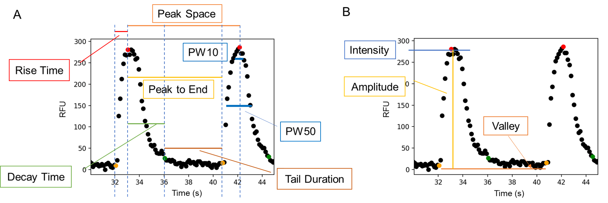
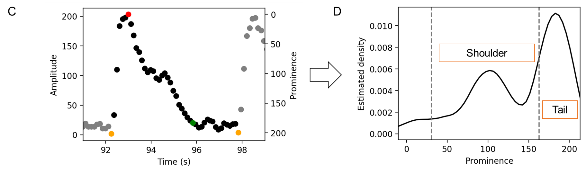

Get Started with CardioWave
===========================

Examples of basic useage
~~~~~~~~~~~~~~~~~~~~~~~~

Prepare a CSV table like this format:

======== ============= ==== ===== ========== ==== ======
compound concentration well plate ..others.. time signal
======== ============= ==== ===== ========== ==== ======
CP1      0.1           A1   P1    ...        0    1000
CP1      0.1           A1   P1    ...        0.33 1001
...      ...           ...  ...   ...        ...  ...
CP2      0.1           A2   P1    ...        0    1000
...      ...           ...  ...   ...        ...  ...
======== ============= ==== ===== ========== ==== ======

The order of the rows and columns do not need to be fixed but the column names
must be exactly the same to the required (e.g. lowercase). The following columns
are compursory: 'plate', 'compound', 'concentration', 'well', 'time', 'signal'.
Optional columns include 'cpid' (compound ID) and 'vendor'. Other columns will
not be used.

.. code-block:: python

    import pandas as pd
    from cdwave import data
    from cdwave import derive

    # Load and convert
    df = pd.read_csv('data.csv')
    loader = data.StandardCSVLoader(data=df)
    dataset = loader.transfer()

    # Calculate parameters
    derive.calc_parameters_for_waveforms(dataset)
    dataset.save('data.pickle.gz')

    # Export parameters
    parameter_df = dataset.get_parameter_df()
    parameter_df.to_csv(os.path.join(data_path, 'parameters.csv'))

Advanced Usage
~~~~~~~~~~~~~~

There are two ways to derive parameters, with and without a threshold.
`calc_parameters_for_waveforms <source/cdwave.html#cdwave.derive.calc_parameters_for_waveforms>`_ and
`calc_parameters_with_threshold <source/cdwave.html#cdwave.derive.calc_parameters_with_threshold>`_.
In either method, you can define a customed function to derive parameters from the waveform data.

.. _custom-calculator:

Derive parameters using a customed calculator
---------------------------------------------

The function should include these steps:

1. Get signal series from waveform data (an `WaveformFull` object) to instantiate `Waveform`

.. code-block:: python

    series = waveform.get_signal_series()
    wave = Waveform(series)

2. Detect peaks

.. code-block:: python
    
    wave.get_peaks()

3. Identify key time points

During this step, double-peaks or multi-peaks will be identified.

.. code-block:: python

    wave.analyse()

4. Derive parameters

By default, use `r = wave.get_parameters()` to calculate all parameters supported.
If only peak count and amplitudes are required, we can just use:

.. code-block:: python

    r = {'maximum': wave.maximum, 'n_peak': wave.num_peak}
    r.update(wave.calc_amplitudes())

The following function is the default calculator in CardioWave for derving
parameters with a threshold.

.. code-block:: python

    def calc_parameter_with_threshold(waveform: WaveformFull, threshold) -> dict:
        series = waveform.get_signal_series()
        wave = Waveform(series)
        if not wave.get_peaks(height=threshold):
            return None
        wave.analyse()
        try:
            r = wave.get_parameters()
        except Exception as e:
            logging.error('Cannot get parameters of %s', waveform)
            raise e
        return r

Selection of hyper-parameters
-----------------------------

The hyper-parameters will affect the detection of the peaks and subpeaks.
In peak detect `get_peaks`, either prominence and height can be set to ignore
"false peaks". If prominence is None, the prominence will be set to
`max(min_prominence, span_ratio * span)`. Span is the difference between the
highest intensity and the lowest intensity. The default span_ratio is 0.1 and
the default min_prominence is 20.

.. plot:: pyplots/peak_example.py

In the left example, the peaks before 6s are all false peaks (red points),
which may caused by noises. 
Their prominences are all lower than 10% of the highest itensity.
The green points are real points as their prominences are far higher than the
threshold.

In the right example, althrough these peaks are real in terms of the pre-set
rule of prominence higher than 0.1 * span, we know that they are actually false
peaks as their signals are very low compared to the left example. However,
CardioWave does not know that. So, one potential solution is to manually set the
threshold by `get_peak(prominence=100)`, where the threshold 100 depends on
the data we have. We can set the threshold according to positive control.

How are the parameters derived
~~~~~~~~~~~~~~~~~~~~~~~~~~~~~~

Firstly, peak detection is implemented to separate the waveforms into
individual wave cycles, from which single wave cycle parameters such as duration
and amplitude can be calculated.

For each cycle of a waveform, parameters can be derived according to the key
time points, including the rising point (the first point of a cycle), peak point
(maximum of a cycle), tail starting point (the first point lower to 10% of
maximum during decay) and valley point (the lowest point in a cycle).

See :ref:`custom-calculator` to know how these steps are implemented.

Frequency and amplitude realted parameters
------------------------------------------

As shown in the figure on the left, the starting points are coloured in orange,
tail starting points in green and peak points in red. A cycle starts from a peak
point to next one. The duration between two peak points is Peak Space. Rise time
is the duration between the starting point and peak point. Decay time is the
duration between a peak point and the corresponding tail starting point in the
cycle. Peak to End is the duration between the peak point and the starting.
Althrough the starting point is for the *next* peak, we say *this* starting
point as it belongs to *this* cycle.

The figure on the right shows the definitions of the amplitude-related
parameters. Intensity is the absolute RFU value of the peak point, while
amplitude this the vertical distance between the peak point and the valley
point.

Shoulder-tail related parameters
--------------------------------

Shoulder-tail related parameters are novel parameters in this tool. This was
inspired by the findings that some waveforms have a shoulder-like, when the
peak space is higher than a normal one (e.g. from DMSO).

Univariate kernel density estimation is used to derive shoulder-related
parameters. The Biweight kernel is used and the bandwidth was set to 0.2 times
of peak amplitude.
In the density distribution, the peak of which the prominence (x axis) is
between 0.15 and 0.8 times of maximum was regarded as shoulder, and prominence
higher than 0.8 times of maximum was regarded as the tail.
Then shoulder position (ratio to the prominence of the peak) and the
Shoulder/Tail are recorded as the parameters of this cycle.
To avoid extremely high values when tail density was close to 0,
the maximum Shoulder/Tail is set to 2.5.

Aggregate the parameters of all cyles
-------------------------------------

After the parameters of cycle has been calculated, statistical parameters such
as mean, standard deviation, and maximum were used to describe the whole
waveform. The following is an example of how average peak amplitude and
standard deviation of peak amplitude are calculated. 

.. math::
    
    \overline{PA} = \frac{1}{N}\sum_{i}^{N}{Amplitude_{i}}

    \sigma (PA) = \sqrt{
        \frac{
            \sum_{i=1}^{N}{
                {(Amplitude_{i}-\overline{PA})}^2
            }
        }{N}
    }

where `i` is the number of cycle and `PA` means peak amplitude

When Aggregating the parameters of all cycles, the first group (signals before
the first peak of the whole waveform) and the last group (signals after the
last peak of the whole waveform) will not be used as they are not entire
cycle.

.. plot:: pyplots/cycles-example.py

Peak and subpeak detection
~~~~~~~~~~~~~~~~~~~~~~~~~~

Peak detection is implemented attempting to get the cycle number of each signal
and to derive parameters from each cycle.
With default setting, peaks of which the prominence is lower than 20 or 10%
of the Maximum Amplitude of the waveform would be regarded as a "false peak",
which means the peak will not be regarded as a peak in the following analysis.
For the boundary of the waveform (the first and the last peaks), the prominences
lie on the inner side of the peaks, i.e. the leftmost peak bases only on the
right side of the peak to measure the prominence.

Two approaches are used to identify multi-peaks, prominence-based and
tail-based. In the prominence-based approach, if the prominence of a peak is
lower than a threshold, and signal or amplitude is close to the last real peak
within 10% of the maximum amplitude (MA), the peak will be regarded as a double
peak or a subpeak. The threshold is determined empirically to be 50% of the
maximum prominence (MP) when MA is lower than 250, and 70% of MP when MA is
higher than 250.

In some situations, the prominence-based approach cannot identify multi-peaks
well. Based on our finding that cycles end with a long tail but the subpeaks
don't, we recognised the subpeaks by comparing their tail with the maximum
tail length in the waveform.

.. plot:: pyplots/double-peak.py

The figure on the left show the original recognitions of the key time points.
The orange are starting points and the green are decay points. Tail duration is
calculated by :math:`starting\ point - decay\ point`.

The duration of the tails are 
`0.5, 1.37, 19.31, 0.62, 17.2, 0.5, 16.22, 0.5, 1.38`
The average tail duration is 6.4 and the standard deviation is 8. We can see
that the standard deviation is more than half of the average, which means there
are double peaks. If the tail duration is lower than
:math:`Max(tails) - \sigma (tails)`, it is regarded as a short tail and the
corresponding peak is marked as a sub-peak. Otherwise, when the tail duration
is within the standard deviation, it will be regarded as a real peak. 
After the adjustion, now there are only four peaks (red points) and the others
are sub-peaks (Megenta points in figure on the right).

.. note::
    For waveforms with multi-peaks, the parameters are imprecise. For example,
    as shown in the figure on the right, the rise time will be the duration
    between the red point and the orange, which is larger than we thought.
    Theratically we can fix it by calculatingthe duration between the first
    sub-peak and the starting point. But it is not implemented yet as we don't
    use the samples with multi-peaks.

Process the parameters
~~~~~~~~~~~~~~~~~~~~~~

After deriving the parameters, we will get a dataframe (``parameter_df``) like
the following table. The the compound name of vehicle control is supposed to be
DMSO.

======== ============= ==== ===== ==============
compound concentration well plate ..parameters..
======== ============= ==== ===== ==============
CP1      0.1           A1   P1    ...           
CP1      0.5           A2   P1    ...           
...      ...           ...  ...   ...           
DMSO                   A5   P1    ...          
...      ...           ...  ...   ...        
======== ============= ==== ===== ==============

Quality control and Normalisation
---------------------------------

The parameters cannot be used directly because of batch effects and variance
of cells. We need to do quality control to remove samples with low quality and
normalise the parameters based on pre-measurement and/or vehicle control.

Quality control can be implemented by 
`remove_low_quality <source/cdwave.html#cdwave.param.remove_low_quality>`_.

Wells of a plate will be removed if:

1. Double peak in negative control
2. High standard deviation of peak space in negative control
3. Low quality in baseline.
   
For any case of the following critera, the well will be removed due to the low
quality of baseline:

1. There is at least one multi-peak
2. standard deviation of peak space is higher than 1
3. maximum amplitude is lower than 100
4. Some key time point (such as decay point) cannot be recognised

Then RCV will be calculated from the DMSO samples of each plate

.. math::

    MAD = med | x_i - m |

    RCV_M = 1.4826 * \frac{MAD}{m}

If RCV >= 0.2, the whole plate will be removed.

Normalisation can be done by
`normalise_by_baseline <source/cdwave.html#cdwave.param.normalise_by_baseline>`_
and 
`normalise_by_negctrl <source/cdwave.html#cdwave.param.normalise_by_negctrl>`_.

Normally we have two ways to normalise the parameters. For value types such as
peak frequency, we suggest using subtraction and division, while for ratio type
and deviation type, we suggest subtraction only.

.. math::

    freq \% = \frac{freq - freq_{baseline}}{freq_{baseline}}

    \sigma(Peak\ Space) \% = \sigma(Peak\ Space) - \sigma(Peak\ Space)_{baseline}

If we don't have baseline data, then we can use the median value of DMSO.

if we have the baseline, we need to normalise again to avoid batch effect.

.. math::

    freq_{DMSO}\% = \frac{freq_{DMSO} - freq_{baseline}}{freq_{baseline}}

    \sigma(Peak\ Space) \% = \sigma(Peak\ Space) - \sigma(Peak\ Space)_{baseline}

    freq \%\% = freq\% - DMSO\%

If we have baseline waveforms, the suggest workflow is like the following.

.. code-block:: python

    value_parameters = ['freq', 'avg_amplitude', 'PW10_mean']
    ratio_parameters = ['shoulder_tail_ratio']
    std_parameters = ['std_amplitude', 'PW10_std']
    subtract_parameters = ratio_parameters + std_parameters
    divide_parameters = value_parameters
    all_parameters = subtract_parameters + divide_parameters

    parameter_df = waveform.get_parameter_df() # Get parameters
    parameter_df, removed_wells = param.remove_low_quality(parameter_df)
    norm_df = param.normalise_by_baseline(
        parameter_df, subtract_parameters, divide_parameters)
    norm_df = param.normalise_by_negctrl(
        parameter_df, 'sm', parameters=all_parameters)

If baseline is not available, we need to normalise by negative control.

.. code-block:: python
    
    standardiser = {'sdm': divide_parameters, 'sm': subtract_parameters}
    norm_df = param.normalise_by_negctrl(parameter_df, standardiser)

Derive IC50 values
------------------
After deriving parameters of the waveforms, we can then derive IC50 values by
analysing the concentration response.

ToxCast Pipeline (TCPL) is implemented. Three curves will be fitted:

1. Hill model
2. Gain-Loss model
3. Constant model

.. image:: https://www.epa.gov/sites/default/files/2017-11/toxcast_dose_response_chart.png

Different from TCPL, CardioWave use the following equation to fit Gain-Loss
model, considering that the parameter would increase from 0 and then reduce to
a negative value.

.. math::

    \mu = tp (\frac{1}{1+10^{gw(ga-x)}+s})
        (\frac{1}{1+10^{lw(x-la)}}) + b

The following is an example of how to derive IC50 of peak frequency for Aspirin.

.. code-block:: python
    
    # norm_df is normalised parameters. See previous section
    compounds = norm_df['compound'].unique()
    dmso_df = norm_df[norm_df['compound'] == 'DMSO']
    cmp_df = norm_df[norm_df['compound'] == compound]
    conc, resp = cmp_df.concentration, cmp_df['freq']
    for fnc in [hillcurve.TCPLHill, hillcurve.TCPLGainLoss, hillcurve.TCPLPlain]:
        try:
            curves.append(fnc(conc, resp))
        except Exception as e:
            pass
    for curve in curves:
        label = '{}-{:.2f}'.format(type(curve).__name__, curve.EC50)
        fnc = np.vectorize(curve.predict)
        ax.plot(cc, fnc(cc), label=label)
    ax.plot(curve.concentrations, curve.responses, 'o', label='Response')
    # Get noise band
    s = dmso_df['freq'].replace(np.inf, np.nan)
    band = s.dropna().std()
    ax.fill_between(cc, -band, band, hatch='////', alpha=0.4,
                    edgecolor='green', linewidth=0, facecolor='white')

`AIC <source/cdwave.html#cdwave.hillcurve.TCPL.AIC>`_
(Akaike information criterion)
can be used to evaluate which model is better
in fitting the concentration response. RSS (residual sum of squares) is used as
the likelihood function. K is the number of estimated parameters. 

.. math::
    
    RSS = \sum_{i=1}^{N}(y_{i}-\hat{y})

    Likelihood = -\frac{N}{2}ln(RSS/N)

    AIC = 2K - 2 Likelihood
